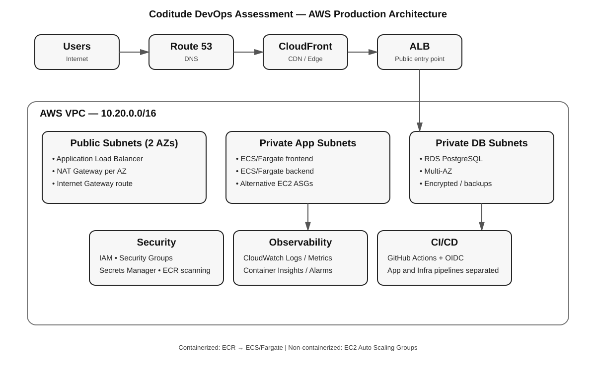

# Architecture Overview

The solution deploys a Next.js frontend, Python FastAPI backend and PostgreSQL database using AWS services. The design uses two Availability Zones, public subnets for the internet-facing load balancer/NAT gateways and private subnets for application and database workloads.

## Containerized path

`Route 53 → CloudFront → ALB → ECS/Fargate → RDS PostgreSQL`

The frontend and backend use separate ECR repositories and ECS services. The ALB sends `/api/*` requests to the backend target group and other requests to the frontend target group.

## Non-containerized path

`Route 53 → ALB → EC2 Auto Scaling Groups → RDS PostgreSQL`

`infra/ec2.yaml` is an alternative deployment stack and is not intended to be deployed at the same time as the ECS stack.

## Environment model

CloudFormation templates accept `dev`, `staging` and `prod` parameters. GitHub Environments can provide environment-specific approvals and IAM role configuration.
